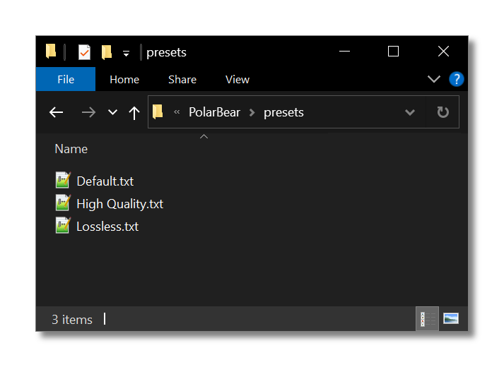

# Video Presets
PolarBear ships with a few presets for lightweight mp4 recording.
The default should be sufficient for most people.

If you want to customize your presets, click the **Open Presets Folder** button in the options screen.
Presets are stored as text files.
You can add, edit, or delete preset files.



After creating or deleting a preset file, click the **Refresh Presets** button to see the changes reflected in the
options screen.

FFmpeg is used to do the screen capture, and presets are just FFmpeg commands with some special, required keywords.
These keywords are used to pass in information, like screen coordinates and video size, from PolarBear's UI.
Click **Presets Help** to view a list of the required keywords.

If you want to create a new preset, it's easiest to start by copying an existing one, and leaving any `<KEYWORD>` in
brackets alone.

#### Example Windows preset using gdigrab
```
<FFMPEG>
-f gdigrab
-framerate <FPS>
-offset_x <X> -offset_y <Y>
-video_size <SIZE>
-i desktop
-c:v libx264
-pix_fmt yuv422p
-crf 23
-preset ultrafast
-tune zerolatency
-vsync 1
-y
<OUTPUT>.mp4
```

See the [FFmpeg documentation](https://ffmpeg.org/ffmpeg.html) for information on FFmpeg commands in general,
and the [FFmpeg devices documentation](https://ffmpeg.org/ffmpeg-devices.html) for specifics on capturing devices.

# Audio
Because PolarBear uses FFmpeg commands to capture video, the command to capture audio will be different on each system.
If you need to capture audio, you'll need to create a preset specific to your system.

# Log Files
If something goes wrong with the video recording, you can check the log files for the full output of the FFmpeg process.
The log files are stored in a folder alongside the user presets.

Windows: `%USERPROFILE%\.config\PolarBear\logs`

Linux: `~/.config/PolarBear/logs`

# FFmpeg Version
PolarBear ships with an embedded version of FFmpeg (from pyffmpeg) to do the screen recording.
If a version of FFmpeg is installed and on the system PATH, it will be used instead.
This behavior can be changed in the options menu.

# Linux
I wrote PolarBear mainly for my own use in Windows,
but there is a Linux build available with a few considerations to be mindful of:

- The Linux build was done on Ubuntu, and hasn't been tested on any other distributions.
- Having your own installation of FFmpeg is strongly advised.
- If the video recording doesn't work out of the box, you may have to write new presets that work with your system.
